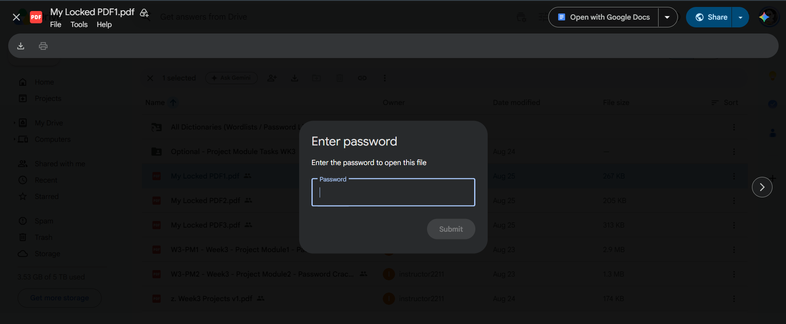
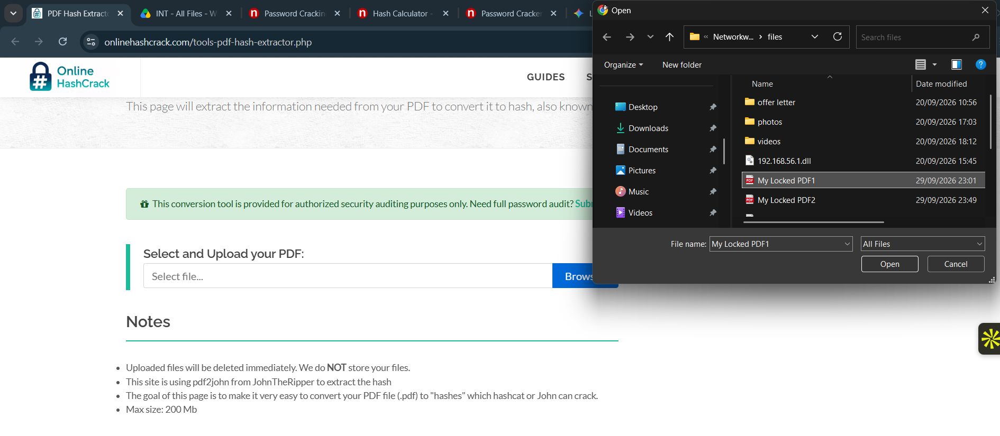
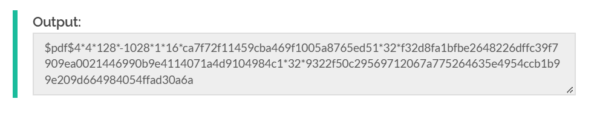
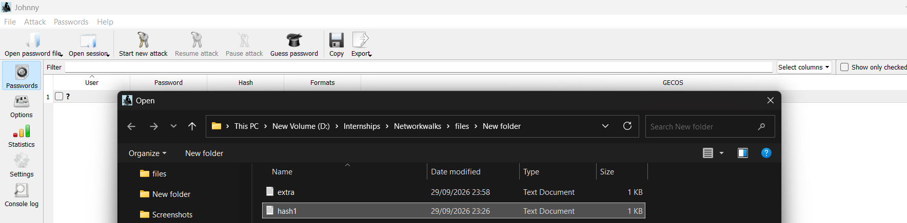
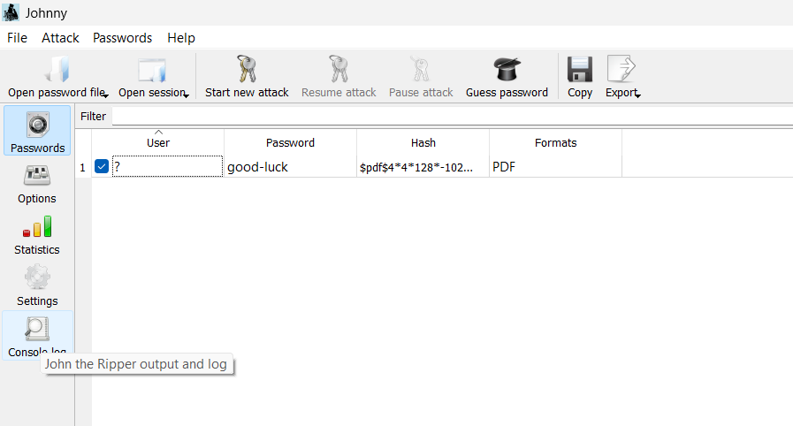
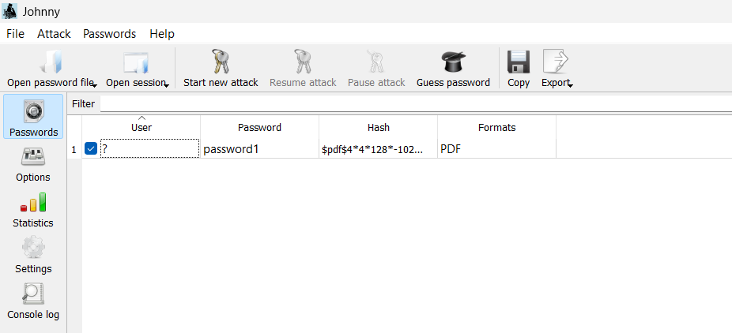
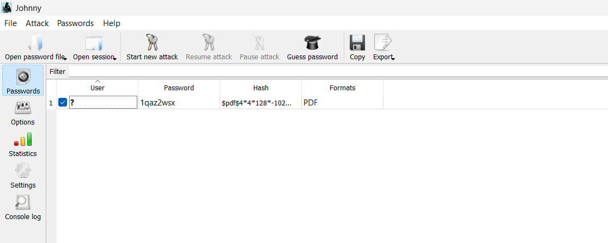

# 🔐 Multi-Target PDF Password Recovery Lab

-brightgreen.svg)

A practical cybersecurity lab demonstrating offline cryptographic hash extraction, dictionary-based password recovery, and document decryption across multiple locked PDF targets using **John the Ripper** and **Johnny GUI**.

---

## 🎯 Target Summary & Recovered Flags

| Target File | Extracted Hash File | Recovered Plaintext | Attack Type | Captured Flag |
| :--- | :--- | :--- | :--- | :--- |
| **`My Locked PDF1.pdf`** | `hash1.txt`| `good-luck` | Dictionary| `nw{cybersecurity_flag_captured_2608}` |
| **`My Locked PDF2.pdf`** | `hash2.txt` | `password1` | Dictionary | `nw{networkwalks_persistence_jtr_270521}` |
| **`My Locked PDF3.pdf`** | `hash3.txt` | `1qaz2wsx` | Dictionary | `nw{networkwalks_flag_200021_1}`|

---

## 🛠️ Tools Used
* **Operating System:** Windows 10/11 x64
* **Target Files:** `My Locked PDF1.pdf`, `My Locked PDF2.pdf`, `My Locked PDF3.pdf`
* **Hash Parser:** Online Hash Crack (`onlinehashcrack.com`) via `pdf2john`
* **Cracking Engine:** John the Ripper (v1.9.0-jumbo-1 OMP x64)
* **GUI Front-End:** Johnny GUI v2.2

---

## 🚀 Step-by-Step Execution

### Step 1: Verify Password-Protected Target
Target documents were inspected, confirming password encryption prompts blocking read access.

---

### Step 2: Upload Target Document for Hash Parsing
Uploaded the target PDF file to the online hash extraction tool to isolate the cryptographic signature.

---

### Step 3: Extract the Cryptographic Hash Signature
The tool converted the document metadata into a standardized `$pdf$4*...` hash format.

---

### Step 4: Save Hashes into the Workspace
Saved the isolated hash strings into separate text files (`hash1.txt`, `hash2.txt`, `hash3.txt`) ready for Johnny GUI ingestion.

---

### Step 5: Crack Target 1 (`hash1.txt`)
Configured Johnny GUI to point to `john.exe`, imported `hash1.txt`, and ran **Start new attack**.
* **Recovered Key:** `good-luck`

---

### Step 6: Crack Target 2 (`hash2.txt`)
Imported `hash2.txt` into Johnny GUI and initiated the dictionary attack.
* **Recovered Key:** `password1`

---

### Step 7: Crack Target 3 (`hash3.txt`)
Imported `hash3.txt` into Johnny GUI and recovered the keyboard walk pattern.
* **Recovered Key:** `1qaz2wsx`

---

